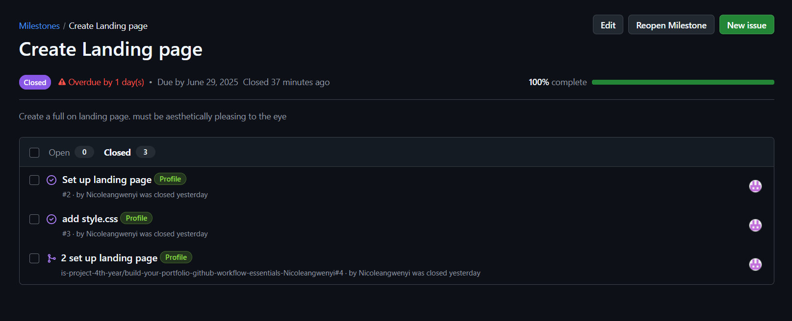
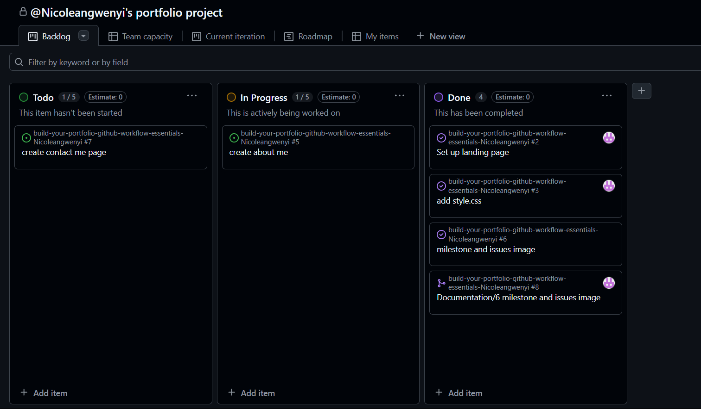
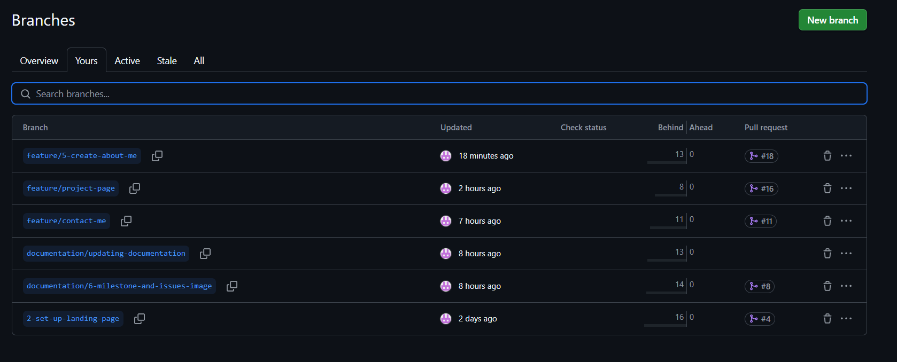
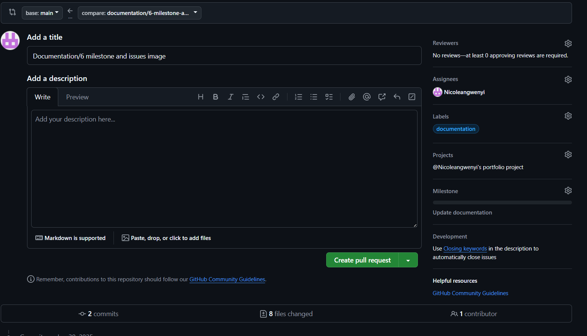

# Personal Portfolio Documentation

## 1. Student Details

- **Full Name**: Nicole Moraa Angwenyi
- **Admission Number**: 141786
- **GitHub Username**: Nicoleangwenyi
- **Email**: nicole.angwenyi@strathmore.edu

## 2. Deployed Portfolio Link

- **GitHub Pages URL**:  
  _(Provide the live link to your deployed portfolio website)_

## 3. Learnings from the Git Crash Program

Write about **4 things** you expected to learn during the Git crash course (yes, we all came in with some big hopes 😅).
For each one, mention:

What you thought it would be like **(Expectation 👀)**

What you actually learned **(Reality 😅)**

And how it helped with your personal portfolio project 💻

make it honest—and if it surprised you, even better!


**🧠 What I Thought I'd Learn vs What I Actually Learned**

**1. Concept: Creating milestones and issues**

`Expectation 👀` : I didn't necessarily know what to expect as I never knew what the purpose for those 2 were. I thought they were decorations.

`Reality 😅`: Turns out milestones and issues help you track your work and creater better order in workflow allowing you to know which task is needed of you. 

`Impact 💡`: I created milestones that helped me stay in track while doing the project giving me ease in workflow.

**2. Concept: Merging Branches**

`Expectation 👀` : I expected to know how to merge branches with ease to stop worrying about working on different branches

`Reality 😅`: I't turned out to be an easy process and now I can do it with ease

`Impact 💡`: I was able to work on different branches confidently without having to worry about merge conflicts as I was confident that if I encountered any, I would easily solve them.


**3. Concept: Deploying on github pages**

`Expectation 👀` : I thought it would be a tideous process that required so many things

`Reality 😅`: Turns out it is actually very simple and you can easily do this hence making websites and hosting doesn't look impossible anymore

`Impact 💡`: I was able to deploy my portfolio with ease and what a smooth process it was.

**4. Concept: Creating Project board**

`Expectation 👀` : I didn't necessarily know what to expect here. 

`Reality 😅`: Found it facinating and a good way to see which issues are at what stage of development

`Impact 💡`: I't made it easy for me to track which issues were at what stage and also trac what was in progress making keeping track of my workflow easier.

## 4. Screenshots of Key GitHub Features

Include screenshots that demonstrate how you used GitHub to manage your project. For each screenshot, write a short caption explaining what it shows.

> Upload the screenshots to your GitHub repository and reference them here using Markdown image syntax:
> (you could just simply copy and paste the image into the Assignment.md)

```markdown

```

### A. Milestones and Issues

This is the nanding page milestone that has completed issues too.
### B. Project Board



- Screenshot of your project board showing the different stages of my project
### C. Branching


- Screenshot of branches in my project

### D. Pull Requests



Screenshot of a pull request creting with linked issue and project
### E. Merge Conflict Resolution

I was unable to make a merge conflict issue